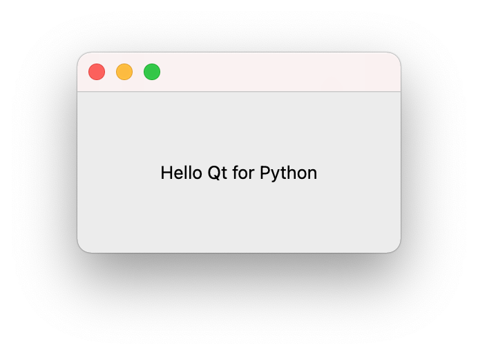

# Hello World

The most simple application, written with Qt for Python.

## Description

The first exercise is most basic. It focuses on discovering the tools and build/run details described in the parent document.

## Tests

A Python unittest defines the greeting message.

```
test_greeting_says_hello (__main__.TestHelloWorld) ... ok

----------------------------------------------------------------------
Ran 1 test in 0.000s

OK
```

## Desktop Application


