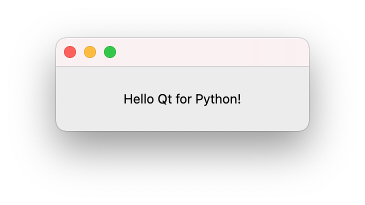

# Hello World

The most simple application, written with Qt for Python.

## Description

The first exercise is most basic. It focuses on discovering the tools and build/run details described in the parent document.

## Desktop Application

