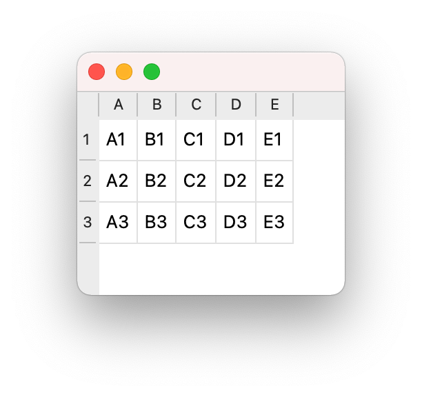

# Fixed Table

A table view widget displays data from a small, fixed, table model.

## Description

The second exercise implements a simple Qt-for-Python model/view application.

The model implementation demonstrates the strong similarities to the C++ version, and also some key differences.

## Tests

A Python unittest suite defines the small, fixed, Python data model.

```
test_displays_data_as_column_letter_row_number (__main__.TestFixedTableModel) ... ok
test_first_column_header_displays_A (__main__.TestFixedTableModel) ... ok
test_first_row_header_displays_1 (__main__.TestFixedTableModel) ... ok
test_has_five_columns (__main__.TestFixedTableModel) ... ok
test_has_three_rows (__main__.TestFixedTableModel) ... ok
test_last_column_header_displays_E (__main__.TestFixedTableModel) ... ok
test_last_row_header_displays_3 (__main__.TestFixedTableModel) ... ok

----------------------------------------------------------------------
Ran 7 tests in 0.001s

OK
```


## Desktop Application



